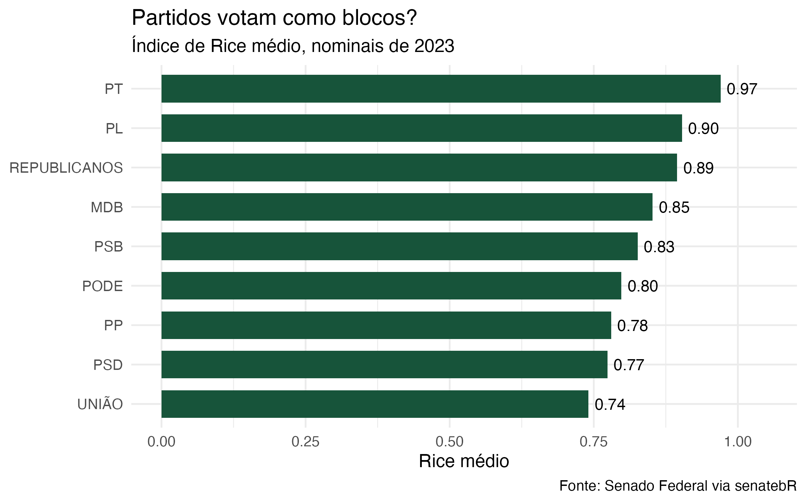

Slides 13–19 — sem laboratório nesta aula. Uma pergunta política de ponta a ponta em ~20 min:
os partidos realmente votam como blocos? Coleta → transformação → Índice de Rice → gráfico →
interpretação.

```{r demo-jogo-completo, file="demo_jogo_completo.R"}
```


