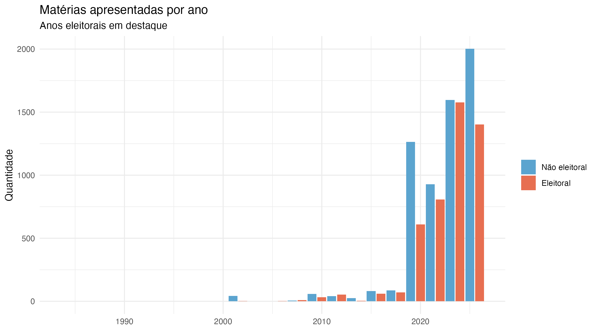

Slide 40 — o calendário eleitoral organiza a produção legislativa? Estudo de caso 3 do livro. O
gráfico não prova a hipótese; ele torna a hipótese discutível.

```{r hipotese-ano-eleitoral, file="03_hipotese_ano_eleitoral.R"}
```


