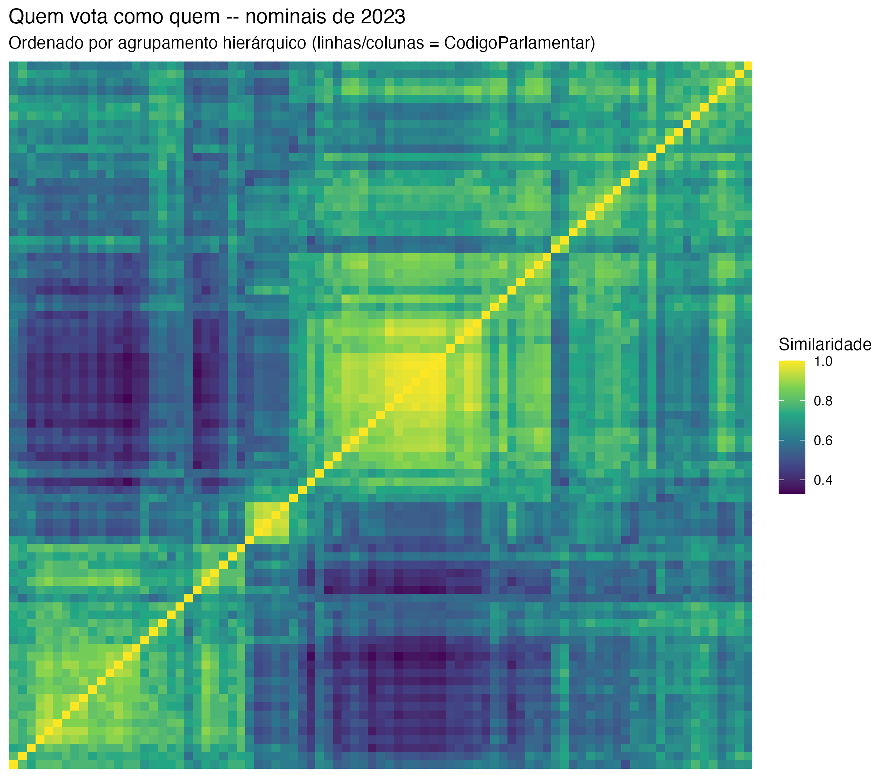

Slide 48 — o momento visual mais forte da oficina. Ordenada por agrupamento hierárquico, a
matriz revela blocos — e os blocos não coincidem perfeitamente com os partidos.

```{r heatmap-similaridade, file="02_heatmap_similaridade.R"}
```


