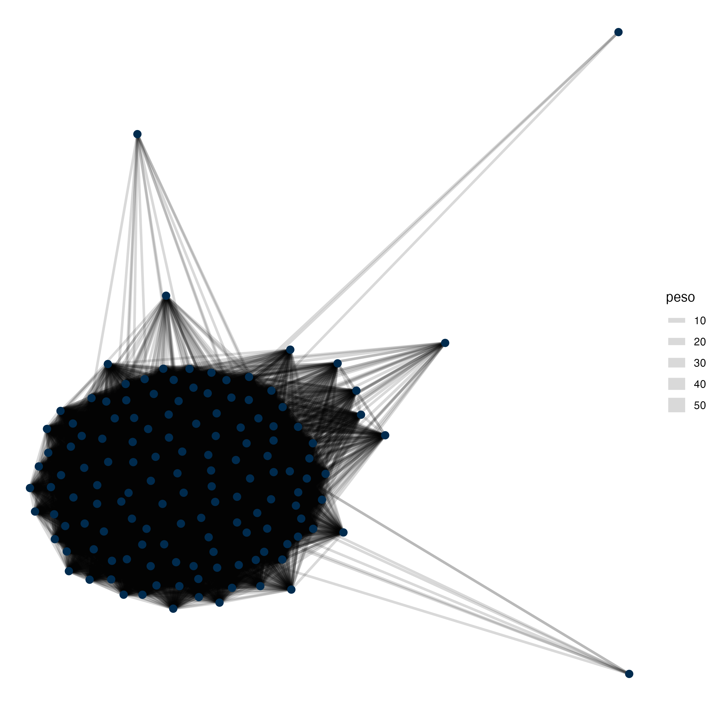

Slide 51 — a última virada. A rede mostra o que nenhuma tabela mostra: a cooperação legislativa
tem geografia própria, e ela não é o mapa dos partidos.

```{r rede-de-coautoria, file="05_rede_de_coautoria.R"}
```


