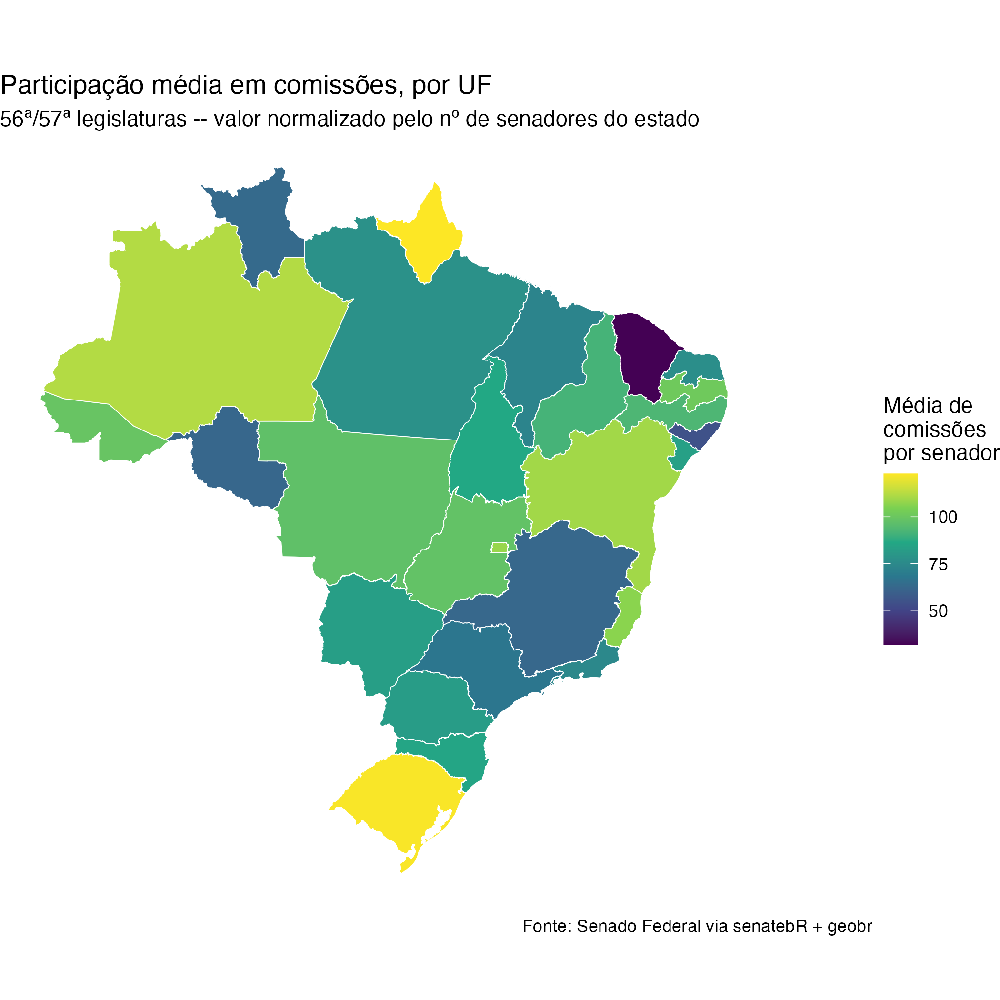

Slide 53 — escolha a geometria a partir da pergunta, não do repertório que você já domina.
`ggplot2` para comparação (já visto em [Quem compõe o Senado?](../aula_02_atores_e_arenas/03-quem-compoe-o-senado.qmd)
e [Olhar só para o plenário é suficiente?](../aula_02_atores_e_arenas/04-arenas-comissoes.qmd)),
`geobr` para território, `gt` para precisão.

```{r comunicacao-visual, file="06_comunicacao_visual.R"}
```


